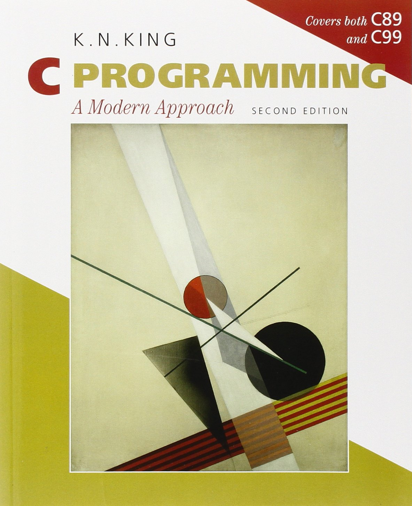

## C Programming: A Modern Approach - Solutions

My solutions to the Exercise and Projects from K. N. King's "C Programming: A Modern Approach", 2nd Edition



[C Programming: A Modern Approach](https://www.amazon.com/C-Programming-Modern-Approach-2nd/dp/0393979504)

All testing was done on a `x86_64 Linux` system running `GCC 11.4.0` or greater.  
The compiler has been set to run the `C89` standard unless otherwise noted:

```bash
gcc -O -Wall -W -pedantic -std=c89 -o filename.o filename.c
```
